# Threat model

This document exists to answer one question when someone proposes a change:
**does this touch a boundary that, if it slips, hands someone else's WHOOP
data or grant to the wrong party?** It is not a compliance artifact and it is
not aspirational — every claim below is grounded in what the #37 audit
(tokens-crypto, oauth, store-tenancy-sql, webhooks-ssrf, leakage-deps-ci-docs)
actually found in this code, including the limitations. Where a control is
weaker than it looks, that is said here, not smoothed over.

If you're changing `auth.py`, `mcpauth.py`, `store.py`'s tenancy guard, or
`webhooks.py`, read the relevant section before you touch it.

## Why this matters

A compromise here is not "a bug got in." It is a standing, silently
refreshable OAuth grant to a year of someone's sleep stages, heart rate,
and workout timestamps (location-adjacent — WHOOP workouts carry GPS-derived
routes for some activity types) — for every member the process holds a
token for, at once. The grant renews itself indefinitely unless someone
revokes it. Design and review against that, not against "leaked API key."

## Assets, ranked by what losing them costs

| Asset | Where it lives | Loss means |
| --- | --- | --- |
| WHOOP refresh token | `token.json` (0600) / OS keychain, `auth.py` | Standing, self-renewing read access to the member's full WHOOP history, until revoked upstream. The highest-value asset in the repo. |
| WHOOP access token | Same store; short-lived | Read access until natural expiry (WHOOP-side TTL), no renewal power alone. |
| `client_secret` / webhook signing secret | Process config, `config.py` | Lets an attacker mint their own token grants against the operator's registered WHOOP app, or forge webhook deliveries. |
| `token_encryption_keys` (AES-256) | Process config | Decrypts every sealed token on disk if the encrypted-file backend is used. |
| Cached health rows (`cache.sqlite3`) | Opt-in only (`WHOOPMCP_CACHE=true` or webhooks enabled) | Sleep/recovery/workout/cycle records for every member ever linked, if an operator turns caching on. Off by default. |
| Audit trail / principal↔member links | Same store | Tool-call metadata (name, timestamp) and which MCP principal maps to which WHOOP member — not health content, but a map of who-accessed-what. |
| Exported data (`export-member --out`) | Operator-chosen path, 0600 | A full copy of one member's data, for as long as the operator keeps the file. |

## Actors

- **Member** — the person who owns the WHOOP account and granted access. The
  party this whole system exists to protect.
- **Local user** (local mode, the default) — runs whoopmcp on their own
  machine, is their own member. Single-tenant; the token store holds exactly
  one grant.
- **Hosted operator** (`WHOOPMCP_TRANSPORT=streamable-http`, #27) — runs
  whoopmcp for other people. Becomes a GDPR Article 9 data controller the
  moment a second member's grant lands in their store (PRIVACY.md §1). This
  is the mode where multi-tenant boundaries (store-tenancy-sql, the inbound
  OAuth hop) actually matter; in local mode they're inert by construction.
- **MCP client** — Claude Desktop, Cursor, or anything else speaking MCP to
  this server. Trusted to relay tool calls faithfully; **not** trusted to be
  free of bugs that duplicate/replay calls — a bare sequential double-call
  needs no malice to trigger a race (tokens-crypto F2). It can no longer
  resurrect a token past logout, though: `logout()`'s credential epoch
  (closed by #142; see "Trust boundaries: the two OAuth hops") discards a
  refresh that finishes after the forget rather than persisting it — see
  Out of scope for the malicious-client case.
- **Model provider** — whatever LLM the MCP client sends tool results to.
  Outside this repo's control; see Out of scope.
- **WHOOP, Inc.** — the data holder and authorization server for the
  outbound hop. Trusted to enforce code single-use, rotate refresh tokens
  correctly, and honor revocation.
- **External attacker** — no account, no local access; reaches only the
  network-facing surfaces: the OAuth redirect/callback, the webhook receiver
  (if enabled), and the streamable-http listener (if enabled).

## Trust boundaries: the two OAuth hops

The #28 module docstring (`mcpauth.py:1-4`) states this precisely — there are
two separate OAuth relationships, different protocols, different tokens,
different threat models, and the code deliberately keeps them in modules
that don't import each other:

```mermaid
flowchart LR
    subgraph outbound["Outbound hop — auth.py — OAuth 2, whoopmcp is the CLIENT"]
        direction LR
        A["MCP tool call\n(whoop_get_sleep, ...)"] --> B["Authenticator\n(auth.py)"]
        B <-->|"authorize / token / refresh\nclient_secret held here"| C["WHOOP\n(Ory Hydra AS)"]
    end

    subgraph inbound["Inbound hop — mcpauth.py — OAuth 2.1, whoopmcp is the RESOURCE SERVER"]
        direction LR
        D["MCP client"] -->|"bearer token"| E["MCPTokenVerifier\n.verify_token()"]
        E -->|"_resolve() is a stub\nreturns None always"| F["/tools demo route only"]
    end

    G["/mcp — the real JSON-RPC endpoint"]

    inbound -.->|"NOT wired in\n(#29 gap)"| G
    G --> B

    style G fill:#3a1a1a,stroke:#c33,color:#fff
    style F fill:#332,stroke:#996
```

**Outbound (auth.py → WHOOP):** this is the hop that actually holds the
asset. `state` is CSRF/injection protection on this hop — generated with
`secrets.token_urlsafe(32)` and checked with `compare_digest` (both sound,
per the oauth audit) — and is now **single-use**: `verify_state` clears
`_pending_state` on a successful check (oauth F1, closed by #146,
`auth.py:777-803`), so a leaked `(code, state)` pair is good for exactly one
authorization-code exchange, not indefinitely many. A *mismatched* state
deliberately does **not** clear `_pending_state` — that's not a residual
version of F1, it's anti-DoS by design: clearing on failure too would let
anyone who can reach the callback URL kill someone else's genuine
in-flight login with one bad guess, and 32 random bytes of `state` leave
nothing worth brute-forcing while the real login is still pending.
Refresh-token rotation's race under two processes sharing one store is also
closed: `_supersedes` is now checked against the *caller's own* original
token, before the store is cleared, when classifying an `invalid_grant`
response (tokens-crypto F1, closed by #144, `auth.py:646-663`,
`945-996`) — so a stale refresh that WHOOP already rotated past no longer
mislabels a sibling process's fresher, still-live grant as gone. `logout()`
now fences an in-flight refresh too (tokens-crypto F2, closed by #142,
`auth.py:769`, `880`, `1015-1033`, `1057-1066`): a monotonic credential
epoch captured at the top of `refresh()`, before the refresh lock is even
acquired, is re-checked immediately before `_do_refresh` persists or
installs its result, so a refresh that completes after an explicit
"forget me" is discarded rather than resurrecting the credential it was
told to forget.

**Inbound (MCP client → whoopmcp):** this hop exists in the code
(`mcpauth.py`) but is a resource-server skeleton, not a working gate.
`_resolve()` is a stub that returns `None` unconditionally
(mcpauth.py:312-342), so every real signature/issuer/audience/expiry check
downstream (`_issued_by_trusted_as`, `_names_this_resource`,
`_is_unexpired`) is exercised only against a hand-built `AccessToken` in
tests — the oauth audit verified those checks fail closed against every
spoofing shape it tried (suffix-host, port, path, userinfo, IDN, non-string
`iss`), but **none of that currently reaches `/mcp`**, the actual JSON-RPC
endpoint tool calls travel over. The verifier is wired only to a demo
`/tools` route (mcpauth.py:77-85, by explicit module-docstring design,
pending #29). Every streamable-http caller today collapses to one sentinel
principal (`server.py:315-318`, `("__local__", None, None)`) and therefore
one shared WHOOP member — safe *only* because the stub rejects everything
and multi-tenancy isn't really turned on yet.

mcpauth F2 — no expiry check of its own — is closed (#164): `_is_unexpired`
(mcpauth.py:183-212) rejects both an expired token and one whose
`expires_at` is absent, and `verify_token` runs it unconditionally alongside
the issuer/audience checks. Scopes were never this verifier's gap to begin
with: `TokenVerifier.verify_token` takes no `required_scopes` to check
against, and the SDK's `RequireAuthMiddleware` enforces scopes itself, by
design, on whatever route it wraps — a second scope check here would just
be a second source of truth that could drift from the first. **A future
change that wires a real `_resolve()` into `/mcp` still inherits a resource
server that trusts its resolver's claims wholesale** for the one thing
`verify_token` structurally cannot check on the resolver's behalf: whether
the resolver verified the token's signature (or introspected it) before
handing back claims as though they were genuine (mcpauth.py:329-339). That
is the highest-leverage place a future regression could land, precisely
because today's gap looks so inert.

## Trust boundary: one process, many members (hosted mode)

Once #29 exists, `store.py`'s tenancy guard is the thing standing between
one member's tool call and another member's rows. It is layered, not a
single check: a SQLite `set_authorizer` callback records every table
touched and requires a `whoop_user_id` read on any scoped table
(`_execute_with_tenancy_authorizer`) — this is the load-bearing control, and
the audit found no way to touch a scoped table without tripping it — plus a
regex-based secondary check (`_statement_restricts_to_one_member`) that is
no longer depth-blind the way it was (#153/#156/#157/#162): the member
predicate must now sit at parenthesis depth zero, not merely somewhere
after the first top-level `WHERE` (#153); comment, string, and now
backtick-/bracket-quoted regions are stripped from the copy the check
searches, so a stray `)` inside a quoted identifier can no longer
desynchronise the depth counter (#156); every arm of a compound statement
(`UNION`/`UNION ALL`/`INTERSECT`/`EXCEPT`) must independently restrict to
the member rather than just whichever arm the check happens to examine
first (#157); and the rollback the check relies on when it rejects a
statement is now enforced even for statement shapes sqlite3's driver does
not auto-wrap in a transaction (#162). One gap remains, named in
`_statement_restricts_to_one_member`'s own docstring rather than smoothed
over here: a fragment sitting *after* a genuinely depth-zero top-level
`WHERE` can still widen the statement's own reach back out —
`WHERE whoop_user_id = ? OR 1 = 1`, or a second `OR`-ed member — because
nothing here understands boolean precedence (store-tenancy-sql F1). That
gap is **latent**: nothing in this codebase today calls `_execute_scoped`
with attacker-shaped SQL, only static in-repo statements. It stops being
latent the moment any future code builds SQL from caller input and routes
it through that path — treat that as a hard line, not a refactor detail.

The webhook consumer is a second, adjacent instance of the same boundary: it
runs with **one process-wide `WhoopClient`** bound to the lifespan
principal, while inbound events carry an arbitrary `whoop_user_id`
(webhooks-ssrf, adjacent observation). In a real multi-member deployment
this means fetching member A's resource with whichever principal's token
the process happens to hold — a tenancy problem, not a webhook-input one,
and squarely #29's to close before hosted mode is safe with real traffic.

## What already holds, and why (don't re-litigate these)

- **Webhook authenticity**: HMAC-SHA256 over the *raw, unparsed* body plus
  timestamp, `compare_digest`, computed before any JSON parse and before any
  reply distinguishes rejection causes (webhooks-ssrf — verified clean).
- **Secrets don't reach logs or exceptions**: every `logger.*` call site and
  every WHOOP-error-echoing exception path across `auth.py`, `client.py`,
  `server.py`, `webhook_processor.py` was enumerated; none carries token,
  secret, or health-field content (tokens-crypto, leakage — verified clean,
  independently, twice).
- **SQL injection**: every dynamic SQL f-string interpolates only fixed,
  module-level allow-listed identifiers, never caller-controlled values
  (store-tenancy-sql — verified clean).
- **Erasure/export completeness**: both are registry-driven and pinned to
  the live schema by tests (`test_erasure_registry_covers_every_schema_table`),
  not a hand-maintained list that can silently drift.

None of the above needed a finding. They're listed so a reader can tell
"checked and solid" from "not looked at" — the standard this document is
held to.

## Closed since this document was first written

The #37 audit found these too; each is closed now by a specific, named
mechanism, not merely "fixed" — recorded here so the next reader can tell
"checked, was broken, now isn't" from "never looked at," the same way
"What already holds" above does for findings that were clean from the
start:

- **OAuth `state` not single-use** (oauth F1) — closed by #146. Mechanism
  above, under "Trust boundaries: the two OAuth hops."
- **Stale-refresh path could destroy a sibling's valid grant** (tokens-crypto
  F1) — closed by #144. Mechanism above, same section.
- **`logout()` didn't fence an in-flight refresh** (tokens-crypto F2) —
  closed by #142. Mechanism above, same section.
- **`_statement_restricts_to_one_member`'s parenthesis-depth-blindness**
  (store-tenancy-sql F1, in its original form) — closed by
  #153/#156/#157/#162. Mechanism above, under "Trust boundary: one process,
  many members" — which also names the one shape that reworking did not
  close (now the sole entry in Known Weaknesses below).
- **mcpauth had no expiry check of its own** (mcpauth F2) — closed by #164.
  Mechanism above, under "Trust boundaries: the two OAuth hops."
- **`repr(Token)`/`repr(Config)` exposed every secret verbatim** if anything
  ever reprs them (tokens-crypto F4 / leakage F7) — closed by #147:
  `field(repr=False)` on `access_token`/`refresh_token` (`Token`) and
  `client_secret`/`token_encryption_keys`/`metrics_token`/
  `metrics_member_salt` (`Config`).
- **`softprops/action-gh-release@v3` was a mutable-tag third-party action**
  inside the `contents: write` release job (leakage F1) — closed by #145:
  pinned by commit SHA
  (`3d0d9888cb7fd7b750713d6e236d1fcb99157228 # v3.0.2`).

## Known weaknesses in scope, not yet fixed

Fresh (#37) findings describing real, bounded gaps — see the audit reports
for the reasoning; this is the pointer, not the argument:

- `_statement_restricts_to_one_member` still can't see boolean precedence: a
  depth-zero member-equality fragment can be widened right back out by a
  trailing `WHERE whoop_user_id = ? OR 1 = 1` (or a second `OR`-ed member)
  immediately after it — the one shape #153/#156/#157/#162 did not close
  (store-tenancy-sql F1, P3, latent).
- Webhook consumer's single process-wide client doesn't bind fetches to the
  event's member (adjacent observation above; blocks real multi-tenant
  webhook handling).

## Explicitly out of scope

This project does not defend against, and reviewers should not expect a fix
for:

- **A compromised or malicious MCP client.** The client holds the bearer
  token and decides what to send to a model provider; nothing on this side
  of the wire can constrain a client that has decided to misbehave.
- **A hostile local user with filesystem/account access.** File
  permissions (0600/0700) are the whole defense; SECURITY.md says this
  explicitly, and no local storage scheme here (or anywhere) defends against
  an attacker who can already read your files as you.
- **The model provider your MCP client talks to.** Tool results — health
  data — flow to whatever LLM the client is configured with, under that
  provider's terms, not this project's. This is inherent to MCP, not a bug
  in whoopmcp (PRIVACY.md §3, SECURITY.md scope section).
- **The WHOOP API's own vulnerabilities.** Report those to WHOOP.
- **Windows file-permission enforcement.** POSIX modes aren't enforced
  there; the token lands at `0666` and the server warns on first write. The
  keyring backend is the documented mitigation, not a repo-side fix.
- **Byte-level residue after retention deletion (as opposed to erasure).**
  `enforce_retention` deletes rows but does not VACUUM; freed pages can
  persist in `cache.sqlite3` until the next `erase-member` compaction
  (leakage F6). Only the explicit erasure path carries the
  verified-at-the-database-level guarantee.

## Using this document

Before merging a change that touches `auth.py`, `mcpauth.py`,
`store.py`'s scoped-execution path, or `webhooks.py`/`webhook_processor.py`,
ask: which asset in the table above does this touch, which actor gets closer
to it, and does the diagram's boundary still hold the same way afterward? If
the honest answer requires updating this file, update it in the same PR —
a threat model that drifts from the code is worse than none, because it
tells the next reader a boundary holds when it no longer does.
